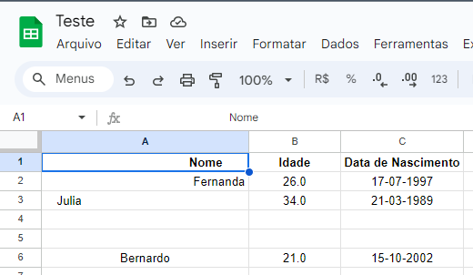
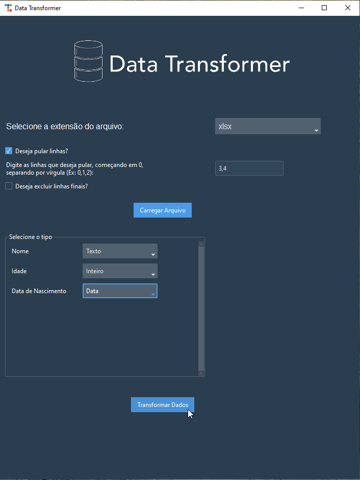
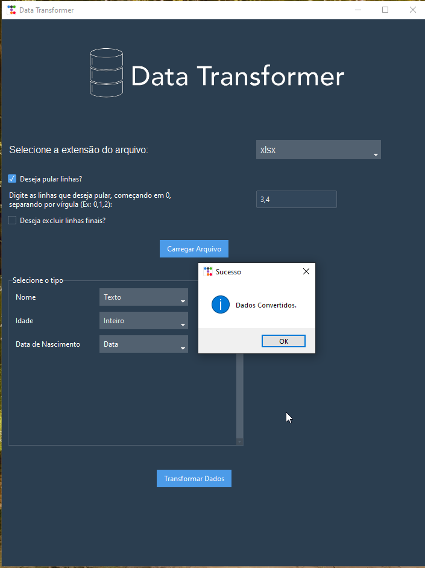
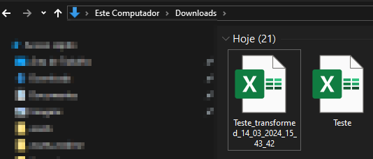
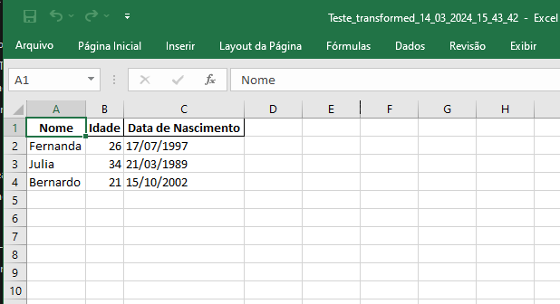
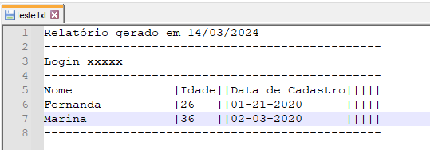
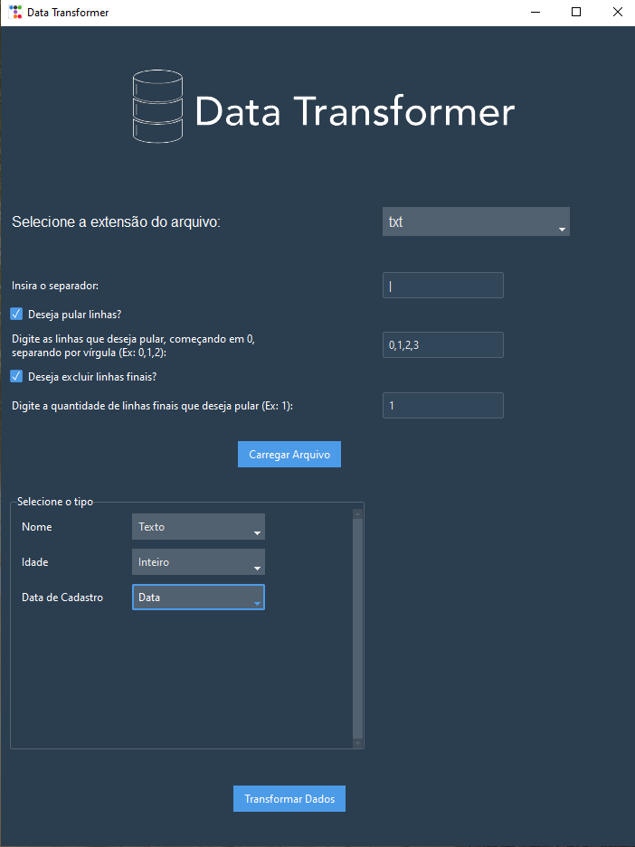
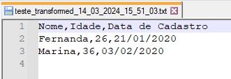

<p align="center">
    
</p>

O Data Transformer é uma ferramenta de ETL (Extract, Transform, Load) projetada para simplificar o processo de transformação de dados em diferentes formatos, incluindo xlsx, CSV e txt. Com uma interface intuitiva, o software permite visualizar, selecionar e processar colunas, além de oferecer opções avançadas como pular linhas e escolher separadores. Esta ferramenta é ideal para preparar dados de forma eficiente antes de carregá-los em sistemas de banco de dados ou realizar análises.

## Funcionalidades Principais

- Carregamento de arquivos em formatos xlsx, CSV e txt.
- Visualização e seleção de colunas para transformação.
- Opções avançadas para pular linhas e escolher separadores.
- Suporte a diferentes tipos de transformações, incluindo conversão de tipos de dados.
- Interface gráfica intuitiva e fácil de usar.

## Demonstração das Funcionalidades

Aqui estão algumas capturas de tela que demonstram as principais funcionalidades do Data Transformer:

# ------------------------------------------
### Exemplo 1:
1. **Arquivo .xlsx inicial:**
O arquivo contém espaços antes e depois de dados, o tipo da coluna idade não está adequado e o arquivo não está formatado.

<p align="center">
    
</p>

2. **Opções selecionadas para tratar o arquivo:**
Seleciona-se o tipo do arquivo, quais colunas deseja-se pula e o tipo das colunas.
<p align="center">
    
</p>

3. **Transformação de dados realizada com sucesso:**
Caso a transformação de dados tenha ocorrido com sucesso uma mensagem é exibida.

<p align="center">
    
</p>

4. **Armazenamento do resultado:**
O arquivo com o resultado é salvo na pasta de "Downloads" do usuário. 

<p align="center">
    
</p>

5. **Resultado Final:**
O novo arquivo com os dados tratados ficou assim.

<p align="center">
    
</p>

# --------------------------------------
### Exemplo 2:
1. **Arquivo .txt inicial:**
O arquivo contém cabeçalho e rodapé, além de dados que não necessários nas linhas iniciais. Além disso há espaços antes e depois de dados e colunas vazias.

<p align="center">
    
</p>

2. **Opções selecionadas para tratar o arquivo:**
Seleciona-se o tipo do arquivo, quais colunas deseja-se pula e o tipo das colunas.

<p align="center">
    
</p>

3. **Resultado Final:**
Como mencionado acima, o arquivo é salvo na pasta de "Downloads" do usuário.
O novo arquivo com os dados tratados ficou assim.

<p align="center">
    
</p>
# -----------------------------------
## Como Usar

1. Baixe e instale o aplicativo.
2. Selecione o arquivo que deseja transformar.
3. Escolha as opções de transformação desejadas.
4. Visualize as colunas e selecione os tipos de dados correspondentes.
5. Execute a transformação e salve o resultado em um novo arquivo.

## Requisitos do Sistema

- Python 3.x
- Bibliotecas Python: tkinter, pandas, Pillow

## Instalação

1. Clone o repositório do projeto:

```bash
git clone https://github.com/seu-usuario/data-transformer.git
```

2. Navegue até o diretório do projeto:

```bash
cd data-transformer
```

3. Instale as dependências:

```bash
pip install -r requirements.txt
```

4. Execute o aplicativo:

```bash
python main.py
```

## Contribuindo

Contribuições são bem-vindas! Sinta-se à vontade para enviar pull requests ou relatar problemas.

## Licença

Este projeto está licenciado sob a [MIT License](LICENSE).